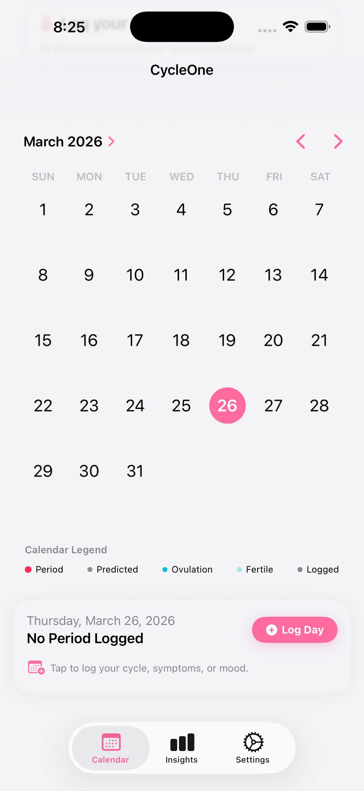
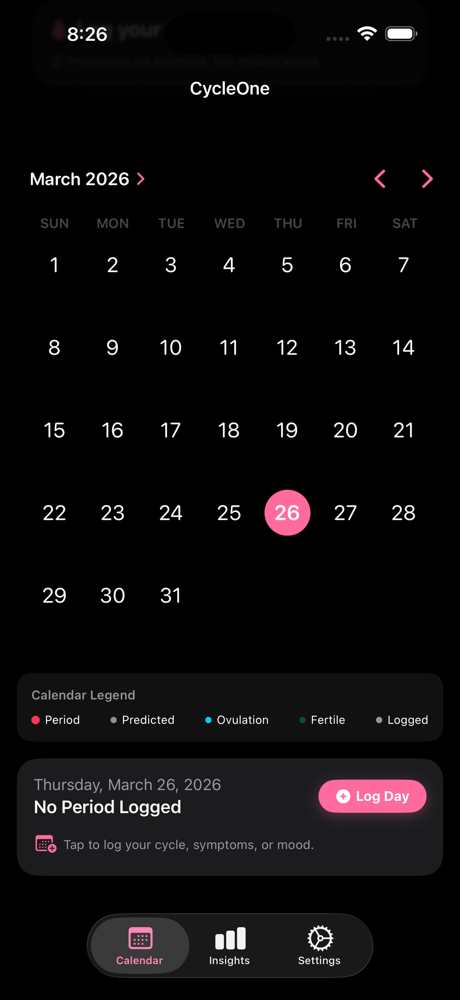
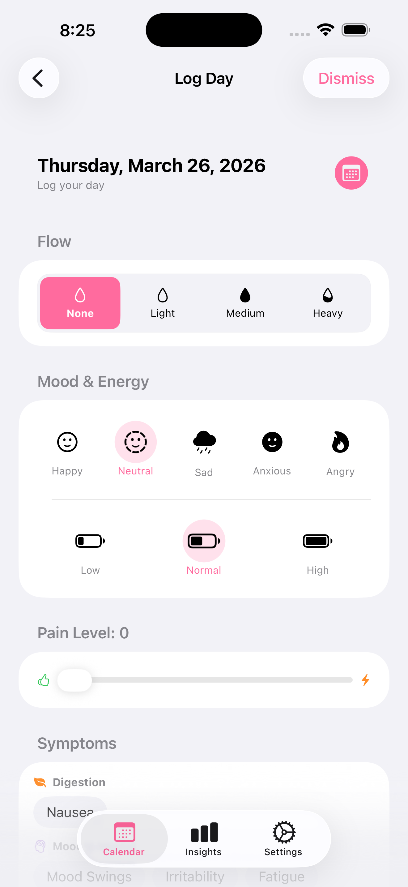
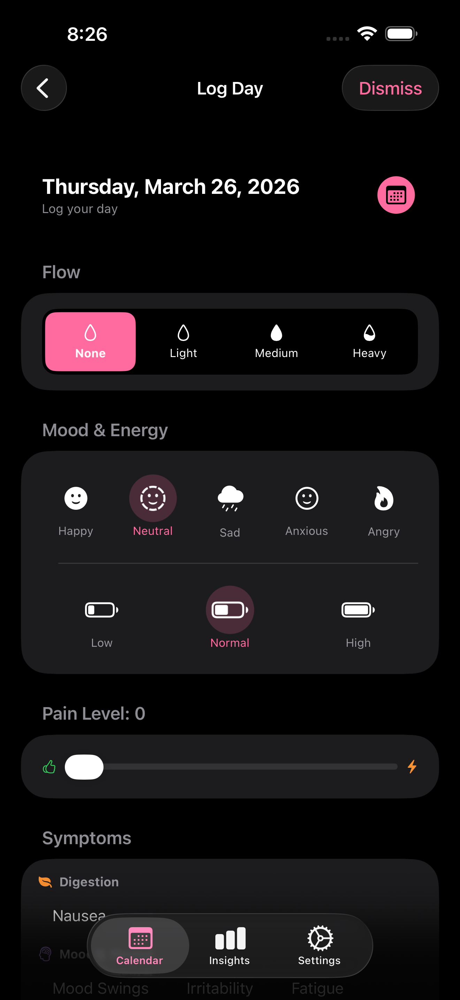
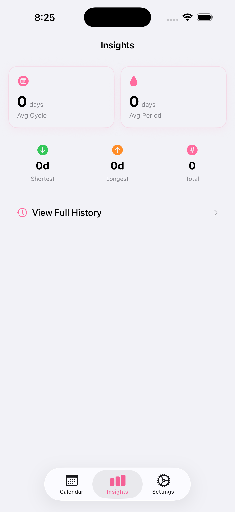
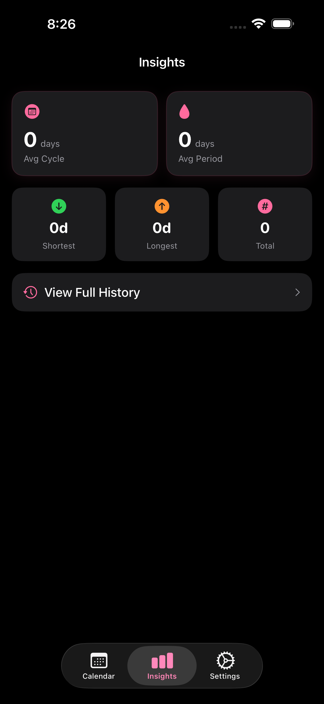
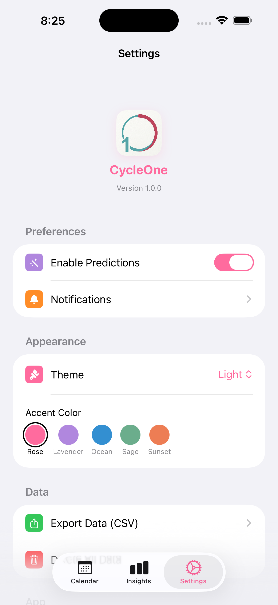
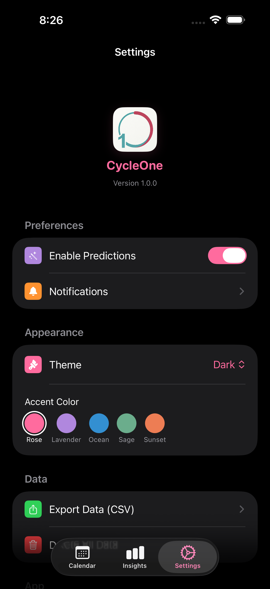

# CycleOne

<p align="center">
  
  <br>
  <b>A privacy-first, sophisticated menstrual cycle & fertility tracker for iOS.</b>
  <br>
  <br>
  
  
  
  
</p>

---

## Overview

**CycleOne** is a high-performance, open-source period tracker designed for users who value **privacy above all else**.

In an era of cloud-connected health apps, CycleOne takes a stand: **Your health data is yours alone.** Built with a strict "local-only" architecture, it provides professional-grade cycle prediction, symptom tracking, and historical analysis without ever requesting network access, requiring an account, or charging a subscription fee.

## Core Features

### Visual Preview

| Light Mode | Dark Mode |
| --- | --- |
|  |  |
|  |  |
|  |  |
|  |  |

### Advanced Prediction Engine
- **Period Projection**: Intelligent estimations for start dates and duration based on historical averages.
- **Ovulation Tracking**: Automatic calculation of ovulation and fertile windows.
- **Irregularity Alerts**: Identifies significant cycle variances to help you remain aware of physiological shifts.

### Holistic Logging
- **Flow Intensity**: Categorical tracking from spotting to heavy flow.
- **Symptom Database**: Track physical, emotional, and digestive indicators.
- **Mood & Energy**: Document biometric indicators with a streamlined, premium UI.
- **Notes**: Local-only annotations for detailed record-keeping.

### Premium User Experience
- **Native Calendar**: Leveraging `UICalendarView` for a high-contrast, interactive experience.
- **Dynamic Themes**: 5 custom accent color themes (Rose, Lavender, Ocean, Sage, Sunset) to match your style.
- **Smooth Animations**: High-fidelity transitions and staggered animations for a premium app feel.
- **Zero Emojis**: A consistent, professional aesthetic using high-quality SF Symbols.

## The Privacy Manifesto

CycleOne was built from the ground up to be safe:
- **No Cloud Sync**: Your data never leaves your device.
- **No Accounts**: No email, no password, no login required.
- **No Analytics**: Zero third-party tracking or telemetry.
- **No Network Entitlements**: The app doesn't even ask for internet permissions.
- **Data Sovereignty**: Export your entire history to CSV anytime.

## Technical Specifications

| Component | Technology |
|---|---|
| **Language** | Swift 5.9+ |
| **Framework** | SwiftUI with MVVM Architecture |
| **Logic** | Proprietary `CycleEngine` (Pure Swift) |
| **Persistence** | Core Data (On-device SQLite) |
| **Interface** | Native UIKit/SwiftUI hybrid |
| **Testing** | XCTest (99 tests currently passing in the full suite: 90 unit + 9 UI) |

## Getting Started

### Prerequisites
- macOS 14.0+
- Xcode 15.0+
- [SwiftLint](https://github.com/realm/SwiftLint) & [SwiftFormat](https://github.com/nicklockwood/SwiftFormat)

### Development Setup
1. Clone the repo:
   ```bash
   git clone https://github.com/VoxDroid/CycleOne.git
   ```
2. Install pre-commit hooks:
   ```bash
   brew install pre-commit
   pre-commit install
   ```
3. Open `CycleOne.xcodeproj` and build for the simulator.

### Workflow Commands
We use a `Makefile` for CI/CD consistency:
- `make check`: Full verification suite (Lint, Format, Test).
- `make unit-test`: Execute logic tests.
- `make ui-test`: Execute integration tests.

### Portable XCTest Command

```bash
DEST_ID=$(xcrun simctl list devices available | awk -F '[()]' '/iPhone/ {print $2; exit}')
if [ -z "$DEST_ID" ]; then
  echo "No available iPhone simulator found."
  exit 1
fi

xcodebuild test \
  -project CycleOne.xcodeproj \
  -scheme CycleOne \
  -destination "id=${DEST_ID}" \
  -parallel-testing-enabled NO \
  -only-testing:CycleOneTests
```

### Coverage Snapshot

Latest stable local run (`TestResults-run9.xcresult`, 2026-04-01):
- `CycleOne.app`: 5,076 / 10,235 lines (49.59%)
- `CycleOneTests.xctest`: 1,799 / 1,817 lines (99.01%)
- `CycleOneUITests.xctest`: 201 / 229 lines (87.77%)

Recent reliability/security improvements in this iteration:
- CSV export now escapes quotes, preserves commas safely, and mitigates spreadsheet formula injection (`=`, `+`, `-`, `@` prefixes).
- Cycle rebuild now logs Core Data fetch/save failures instead of silently swallowing errors.
- Log saving now enforces the Core Data note-length limit (500 chars) to prevent save failures from oversized notes.

## Contributing

We welcome contributions! Please see [CONTRIBUTING.md](CONTRIBUTING.md) for guidelines on how to get involved.

## License

CycleOne is released under the **GNU General Public License v3.0**. See [LICENSE](LICENSE) for details.

---

<p align="center">
  Designed and developed by <b>VoxDroid</b>.
  <br>
  © 2026 VoxDroid. All rights reserved.
</p>
